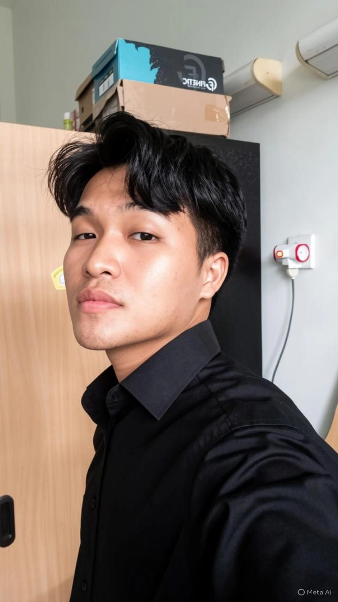

#  Struktur Data — Catatan Belajar

  

    

      Semester Genap 2025/2026
    

    <h2 class="header-title">Catatan Belajar Struktur Data</h2>
    

    
S1 Teknik Informatika &nbsp;·&nbsp; Universitas Trunojoyo Madura &nbsp;·&nbsp; Semester II

  

  

   
    

      

        

          <!-- Ganti src dengan path foto kamu, contoh: images/foto_ghufron.jpg -->
          <!--  -->
          🎓
        

        

          
Mahasiswa

          
Moh. Ghufron

          
250411100196

        

      

      

      

        

          Nama Panggil
          Ghufron
        

        

          Fakultas
          Teknik / Informatika
        

        

          Program Studi
          S1 Teknik Informatika
        

        

          TTL
          Bangkalan, 18 Desember 2005
        

        

          Agama
          Islam
        

        

          Domisili
          Telang, Kamal, Bangkalan
        

        

          WhatsApp
          085189374748
        

        

          Email
          humas@trunojoyo.ac.id
        

      

    

    

      

        

          
          
          👩‍🏫
        

        

          
Dosen Pengampu

          
Dr. Arik Kurniawati S.Kom., M.T

          
197803092003122009

        

      

      

      

        

          NIP / NIDN
          197803092003122009
        

        

          Jabatan
          Dosen Pengampu Struktur Data
        

        

          Jadwal Bimbingan
          Setiap Selasa, 13:00 WIB
        

        

          No. Telepon
          —
        

        

          Email Dosen
          —
        

      

    

  

  

    

      📋
      
Data Akademik

    

    

      

        
Mata Kuliah

        Struktur Data
      

      

        
Periode Semester

        
Genap 2025/2026

      

      

        
Jadwal Bimbingan

        
Selasa, 13:00 WIB

      

    

  

  
Catatan ini dibuat sebagai dokumentasi belajar pribadi &nbsp;·&nbsp; Universitas Trunojoyo Madura

 
## Materi

1. Stack & Queue
2. Infix, Prefix, dan Postfix
3. Sorting
4. Hashing
5. List

## Tugas

1. Stack

> Dibuat menggunakan Jupyter Book_2026